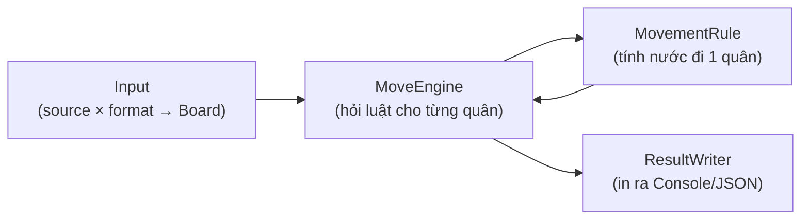
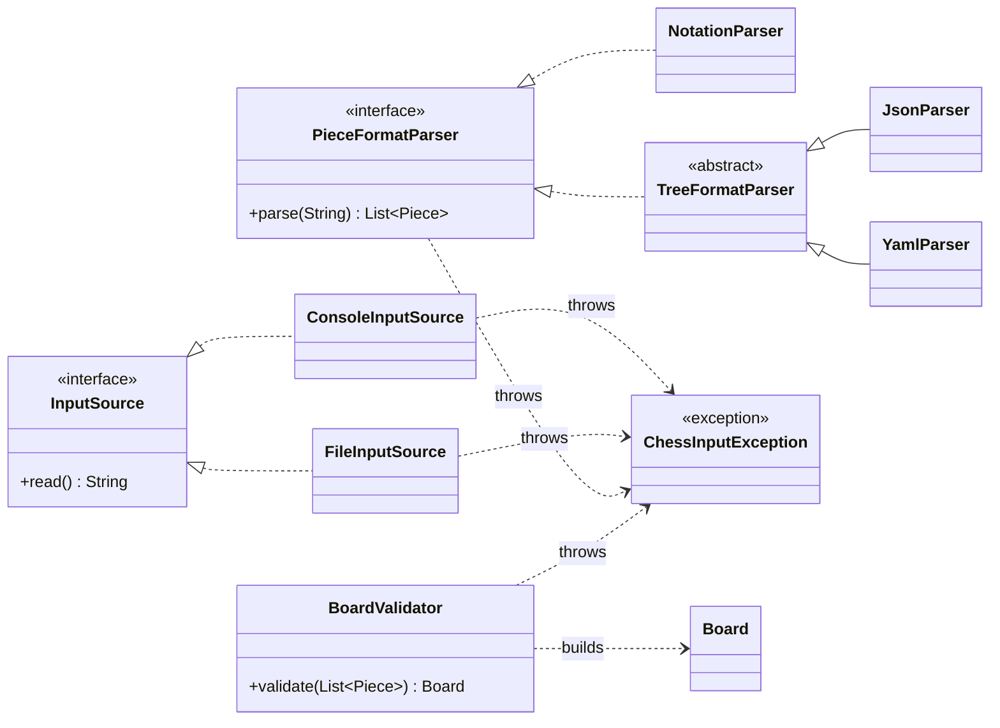
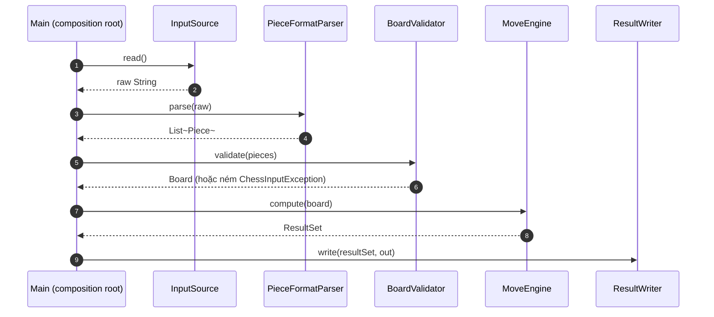
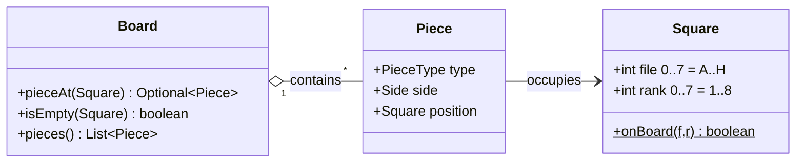
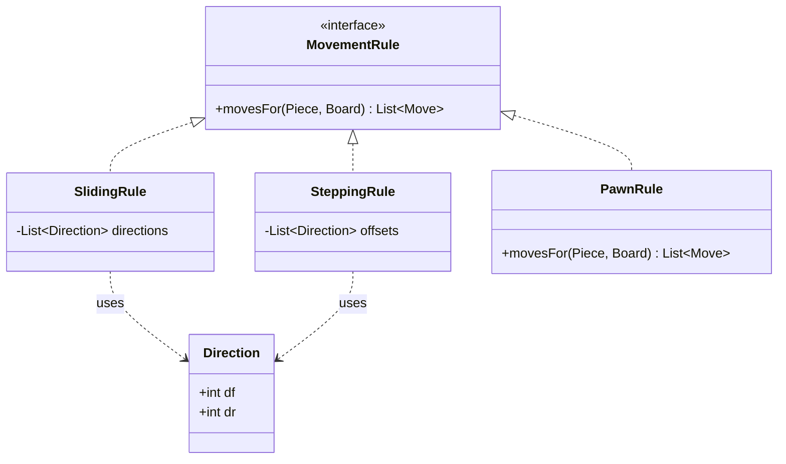
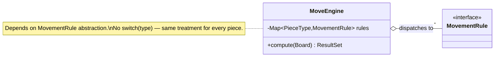
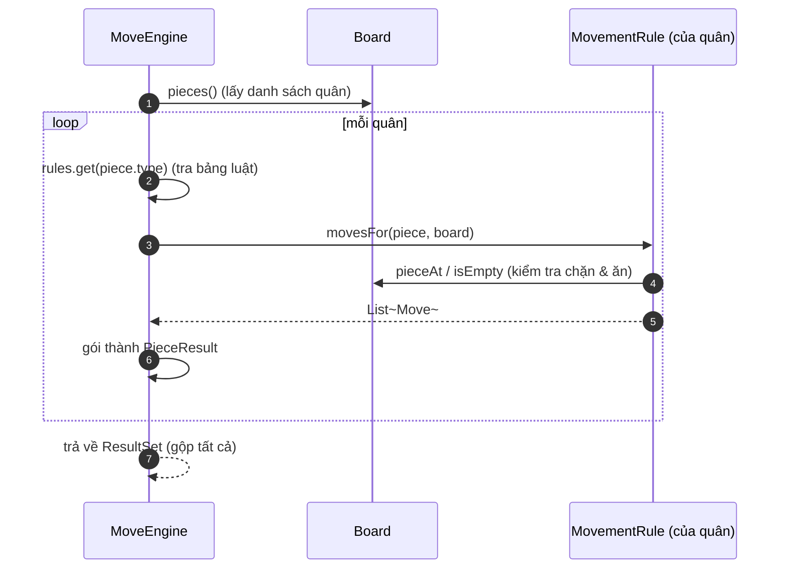
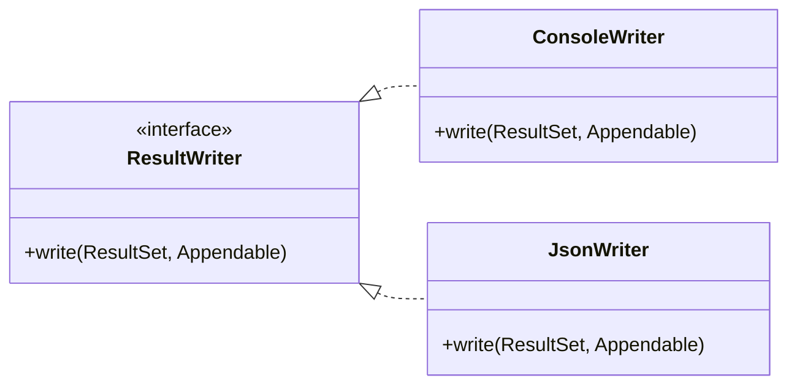
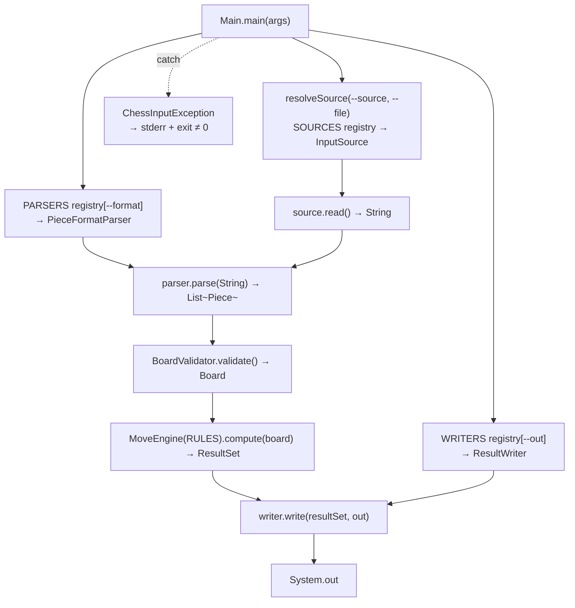
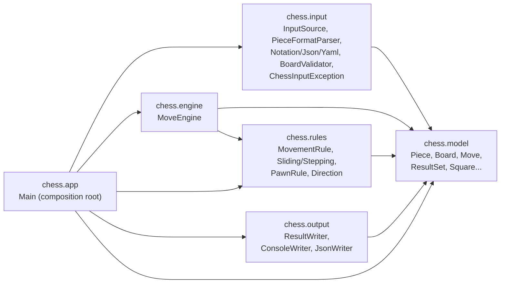

# Diagrams

| Ký hiệu Mermaid | Loại quan hệ | Ý nghĩa |
|---|---|---|
| `A <\|.. B` | Realization | `B` implements interface `A` |
| `A --> B : label` | Association | `A` giữ tham chiếu tới `B` (label = vai trò) |
| `A ..> B : uses` | Dependency | `A` dùng `B` thoáng qua (tham số/biến cục bộ) |
| `A o-- "*" B` | Aggregation | `A` gom nhiều `B`; `"1" / "*"` là multiplicity |

Multiplicity: `1` = đúng một, `*` = không hoặc nhiều, `0..1` = tối đa một.

---

## Overview

- **⓪ Input** đọc bytes (file/console) rồi parse (notation/YAML/JSON) → validate → `Board`.
- **① Board** (kết quả của chặng ⓪) giữ trạng thái: ô nào có quân gì.
- **② MoveEngine** duyệt từng quân, tra bảng luật, gom kết quả.
- **③ MovementRule** : cho 1 quân + bàn cờ → danh sách nước đi.
- **④ ResultWriter** in kết quả theo dạng dưới Console/JSON

Mỗi chặng = một trách nhiệm tách biệt (SRP). Dưới đây soi từng chặng.

---

## Mục ⓪ — Nạp input (2 chiều trực giao: source × format)

Trước khi có `Board`, phải lấy quân từ đâu đó. Đây là phần đề soi kỹ nhất: **"nơi lấy bytes"** và
**"cách hiểu bytes"** là hai chiều ĐỘC LẬP, gặp nhau ở `String`.

**Cách đọc — hai chiều gặp nhau ở `String`:**
1. **Chiều SOURCE** (`InputSource`): chỉ trả `String`, KHÔNG biết định dạng. `ConsoleInputSource`
   (stdin), `FileInputSource` (file).
2. **Chiều FORMAT** (`PieceFormatParser`): nhận `String` → `List<Piece>`, KHÔNG biết nguồn.
   `NotationParser` (compact) đứng riêng; `JsonParser`/`YamlParser` chia sẻ `TreeFormatParser`
   (chỉ khác nhau ObjectMapper JSON vs YAML).
3. Ghép ở composition root: `parser.parse(source.read())` → **bất kỳ format nào × bất kỳ source nào**.
4. **Validate một chỗ**: `BoardValidator` biến `List<Piece>` → `Board`, kiểm tra trùng ô (off-board
   đã chặn khi tạo `Square`). KHÔNG lặp validate trong từng parser.
5. **Lỗi hội tụ**: mọi vấn đề (file thiếu, cú pháp sai, unknown type, trùng ô) → `ChessInputException`,
   `Main` bắt một chỗ, in clear error + exit ≠ 0.

> Điểm mấu chốt (đề soi): thêm một FORMAT mới (ví dụ FEN) KHÔNG đụng source hay parser khác; thêm
> một SOURCE mới (ví dụ URL) KHÔNG đụng parser. Đó là vì ranh giới giữa hai chiều chỉ là `String`.

### Pipeline nạp input → kết quả (đầy đủ)

---

## Mục ① — Dữ liệu trên bàn cờ (Bàn cờ, quân cờ, vị trí ô)

Đây là các "danh từ" của bài: quân, ô, bàn cờ. Chúng **chỉ giữ dữ liệu**, không tính toán, không in.

**Cách đọc:**
1. Một `Piece` biết 3 điều: loại (`type`), phe (`side`), đang đứng ở `Square` nào.
2. `Square` là toạ độ (file, rank) — có hàm `onBoard` để chặn ra ngoài bàn.
3. `Board` là "bản đồ" tra cứu: đưa một ô → trả quân ở đó (hoặc rỗng). Đây là thứ mọi luật đi
   sẽ hỏi để biết đường có bị chặn không.

> Ghi nhớ: `Board` chỉ trả lời câu hỏi "ô này có gì?", **không** tự tính nước đi.

---

## Mục ③ — Rule (MovementRule)

*(Xem chặng ③ trước ② vì hiểu luật 1 quân rồi mới thấy engine điều phối thế nào.)*

Mọi quân đều trả lời **cùng một câu hỏi**: "cho tôi bàn cờ này, tôi đi được những ô nào?".
Câu hỏi đó là interface `MovementRule`. Có 3 cách trả lời:

**Note:**
1. **SlidingRule** (trượt): đi theo mỗi hướng cho tới khi gặp mép bàn / quân cùng phe (dừng) /
   quân địch (ăn rồi dừng). Chỉ khác nhau ở **danh sách hướng**:
   - Rook = 4 hướng thẳng, Bishop = 4 hướng chéo, Queen = cả 8 hướng.
2. **SteppingRule** (nhảy 1 nhịp): thử từng offset cố định, đúng 1 bước:
   - King = 8 ô quanh, Knight = 8 offset chữ L.
3. **PawnRule** (riêng): đi thẳng vào ô trống, ăn chéo vào quân địch — hướng đi ≠ hướng ăn nên
   không nhét chung được vào 2 họ trên.

> Điểm mấu chốt: cùng 6 quân nhưng chỉ **3 class** nhờ 2 họ dùng lại theo "danh sách hướng"
> (`Direction`). Thêm quân mới chỉ là chọn bộ hướng — không viết engine lại (OCP).

### Một quân được tính như thế nào? (ví dụ Rook ở A1)

**Note:**
1. Với mỗi hướng, bước tiếp khi ô trống.
2. Gặp quân cùng phe thì dừng.
3. Gặp quân địch thì thêm nước ăn `(x)` rồi dừng.

---

## Mục ② — MoveEngine

Engine **không biết** luật của từng quân. Nó chỉ có một bảng tra `PieceType → MovementRule` và
lần lượt hỏi từng quân.

**Note:**
1. Engine lấy danh sách quân từ `Board`.
2. Với mỗi quân: tra bảng luật theo `type` → được đúng `MovementRule` của quân đó.
3. Hỏi rule "đi được đâu?" → nhận `List<Move>`, gói thành `PieceResult`.
4. Gộp tất cả thành `ResultSet`.

> Vì engine chỉ nói chuyện với interface `MovementRule` (không `if quân là Knight`), thêm quân
> mới **không** đụng engine. Đây là LSP + OCP + DIP thể hiện cùng lúc.

---

## Mục ④ — Result

`ResultSet` là dữ liệu thuần. Việc "biến thành chữ" giao cho writer — mỗi format một class.

**Note:**
1. Cùng một `ResultSet`, đưa cho `ConsoleWriter` ra text dễ đọc, đưa cho `JsonWriter` ra JSON.
2. `write` ghi vào `Appendable` (một "cái phễu" chung): production dùng `System.out`, test dùng
   `StringBuilder` → **test không cần I/O thật** (DIP proof).
3. Thêm format mới (XML/text...) = thêm 1 class writer, không đụng engine/luật đi.

---

## Mục ⑤ — Main (Ghép các đối tượng + rule...)

Đây là chỗ **duy nhất** biết tất cả các mảnh ghép cụ thể và nối chúng lại. Ba trục chọn qua
**registry + cờ CLI**; lỗi input hội tụ và được bắt tại đây.

**Note:** `Main` (1) tra 3 registry theo cờ CLI để lấy source/parser/writer, (2) chạy pipeline
`read → parse → validate → compute → write`, (3) bọc toàn bộ trong try/catch để mọi
`ChessInputException` in clear error + thoát mã ≠ 0. Các mảnh còn lại **nhận** dependency, không tự
`new` lẫn nhau.

> Extension point: thêm 1 source/format/writer = thêm 1 dòng vào registry tương ứng (`SOURCES`,
> `PARSERS`, `WRITERS`); thêm 1 quân = thêm 1 dòng vào `RULES`. Không sửa lõi.

---

## Follow step (Hiểu logic)

1. **Overview** — nắm 5 chặng.
2. **Mục ⓪** — hiểu cách nạp input (source × format → Board).
3. **Mục ①** — hiểu dữ liệu (Piece/Square/Board).
4. **Mục ③** — hiểu 1 quân tính nước đi ra sao (kèm flowchart Rook).
5. **Mục ②** — hiểu engine điều phối nhiều quân.
6. **Mục ④** — hiểu xuất kết quả nhiều format.
7. **Mục ⑤** — hiểu nơi ráp nối (registry + pipeline + xử lý lỗi).

Mỗi mục là một trách nhiệm (SRP); các mũi tên giữa chặng luôn đi qua **interface** (OCP/LSP/DIP).

---

## 

**Chiều phụ thuộc:** mọi thứ hướng về `model` (state thuần), không phụ thuộc vòng.
Đặc biệt `engine`/`rules`/`output` **KHÔNG** phụ thuộc `chess.input` — ranh giới này được khoá bằng
`ArchitectureBoundaryTest` (fitness function). `app` là nơi duy nhất biết tất cả concretion.
