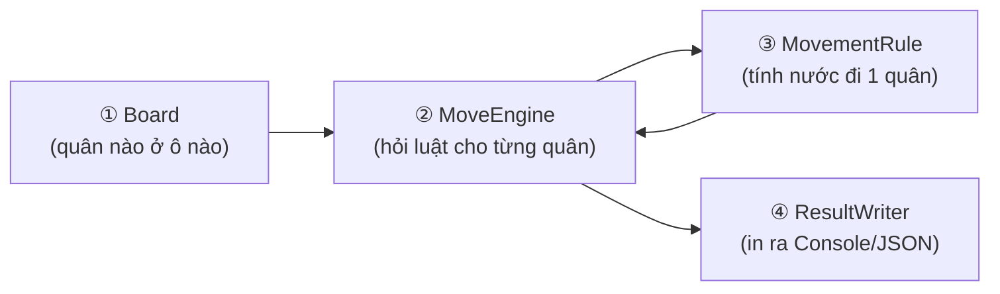
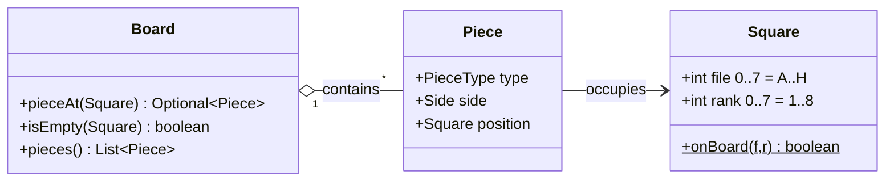
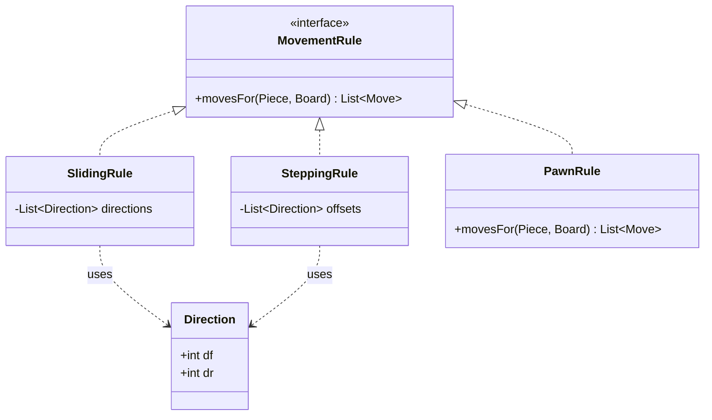
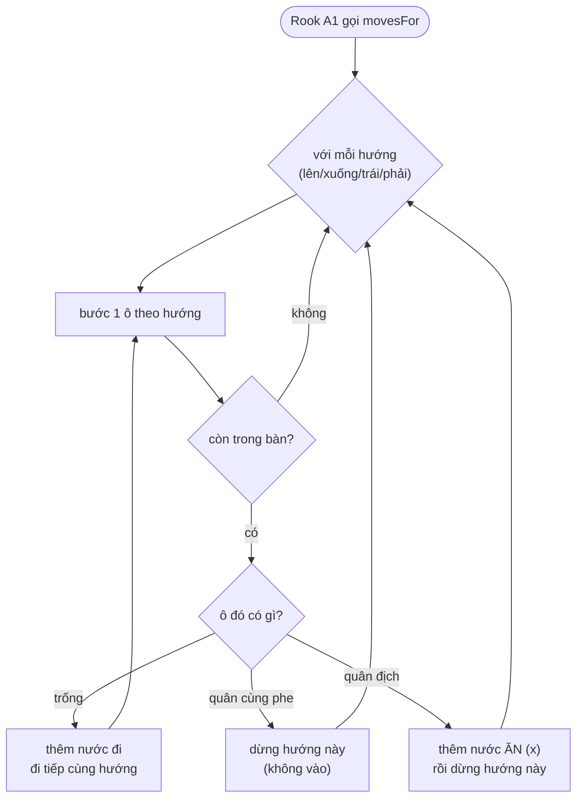
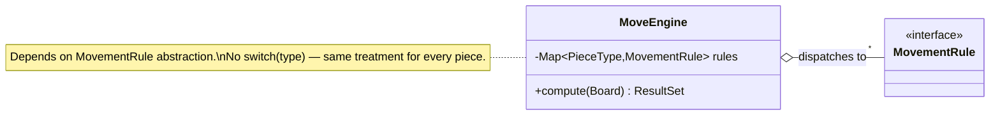
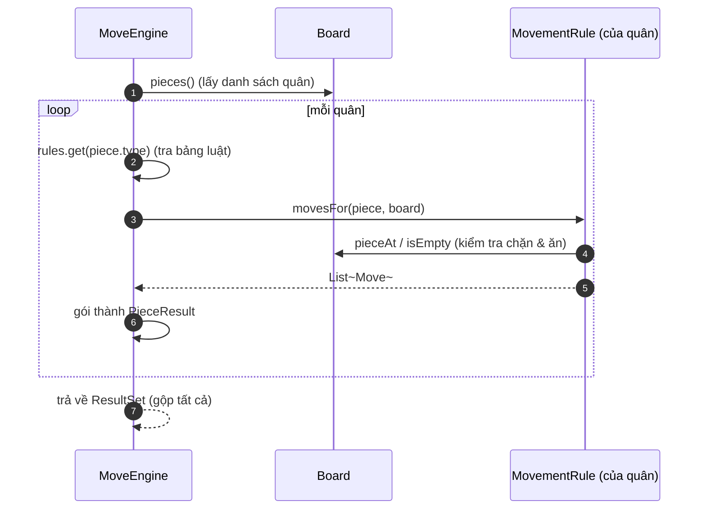
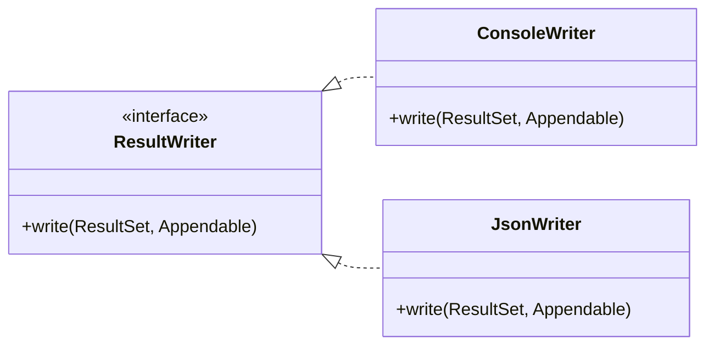
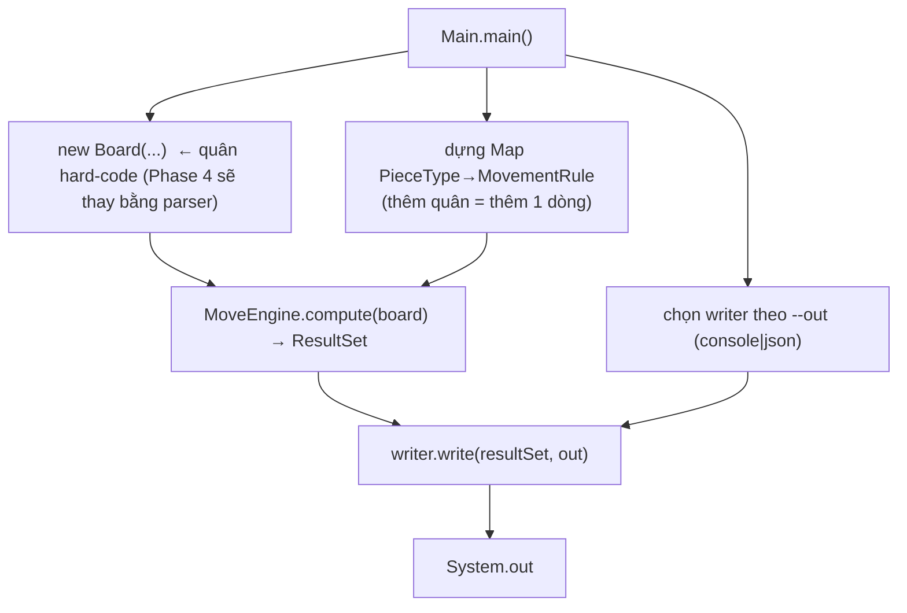

# Diagrams — Hiện trạng sau Phase 3 (bản dễ đọc)

> Phản ánh **code thực tế tới hết Phase 3**. Input còn hard-code trong `Main` (Phase 4 mới thêm
> `InputSource`/`PieceFormatParser`/`BoardValidator`). Mọi sơ đồ Mermaid đã được render kiểm tra hợp lệ.
> Tham chiếu: `../design.md`, `../specs/`.

Thay vì một sơ đồ lớn, tài liệu này **kể lại hành trình của dữ liệu** qua 4 chặng, mỗi chặng một
sơ đồ nhỏ + giải thích. Đọc lần lượt từ trên xuống là hiểu toàn bộ hệ thống.

---

## Chú giải ký hiệu UML (class diagram)

Các class diagram dưới đây dùng ký hiệu UML chuẩn cho nhãn quan hệ (giữ tiếng Anh để không sai nghĩa):

| Ký hiệu Mermaid | Loại quan hệ | Ý nghĩa |
|---|---|---|
| `A <\|.. B` | Realization | `B` implements interface `A` |
| `A --> B : label` | Association | `A` giữ tham chiếu tới `B` (label = vai trò) |
| `A ..> B : uses` | Dependency | `A` dùng `B` thoáng qua (tham số/biến cục bộ) |
| `A o-- "*" B` | Aggregation | `A` gom nhiều `B`; `"1" / "*"` là multiplicity |

Multiplicity: `1` = đúng một, `*` = không hoặc nhiều, `0..1` = tối đa một.

---

## Toàn cảnh 30 giây — 4 chặng

- **① Board** giữ trạng thái: ô nào có quân gì.
- **② MoveEngine** duyệt từng quân, tra bảng luật, gom kết quả.
- **③ MovementRule** là "bộ não" của mỗi quân: cho 1 quân + bàn cờ → danh sách nước đi.
- **④ ResultWriter** biến kết quả thành chữ (Console) hoặc JSON.

4 chặng = 4 trách nhiệm tách biệt (đây chính là SRP). Dưới đây soi từng chặng.

---

## Chặng ① — Dữ liệu trên bàn cờ (model thuần)

Đây là các "danh từ" của bài: quân, ô, bàn cờ. Chúng **chỉ giữ dữ liệu**, không tính toán, không in.

**Cách đọc:**
1. Một `Piece` biết 3 điều: loại (`type`), phe (`side`), đang đứng ở `Square` nào.
2. `Square` là toạ độ (file, rank) — có hàm `onBoard` để chặn ra ngoài bàn.
3. `Board` là "bản đồ" tra cứu: đưa một ô → trả quân ở đó (hoặc rỗng). Đây là thứ mọi luật đi
   sẽ hỏi để biết đường có bị chặn không.

> Ghi nhớ: `Board` chỉ trả lời câu hỏi "ô này có gì?", **không** tự tính nước đi.

---

## Chặng ③ — Bộ não của từng quân (MovementRule)

*(Xem chặng ③ trước ② vì hiểu luật 1 quân rồi mới thấy engine điều phối thế nào.)*

Mọi quân đều trả lời **cùng một câu hỏi**: "cho tôi bàn cờ này, tôi đi được những ô nào?".
Câu hỏi đó là interface `MovementRule`. Có 3 cách trả lời:

**Cách đọc — 3 "họ" luật:**
1. **SlidingRule** (trượt): đi theo mỗi hướng cho tới khi gặp mép bàn / quân cùng phe (dừng) /
   quân địch (ăn rồi dừng). Chỉ khác nhau ở **danh sách hướng**:
   - Rook = 4 hướng thẳng, Bishop = 4 hướng chéo, Queen = cả 8 hướng.
2. **SteppingRule** (nhảy 1 nhịp): thử từng offset cố định, đúng 1 bước:
   - King = 8 ô quanh, Knight = 8 offset chữ L.
3. **PawnRule** (riêng): đi thẳng vào ô trống, ăn chéo vào quân địch — hướng đi ≠ hướng ăn nên
   không nhét chung được vào 2 họ trên.

> Điểm mấu chốt: cùng 6 quân nhưng chỉ **3 class** nhờ 2 họ dùng lại theo "danh sách hướng"
> (`Direction`). Thêm quân mới chỉ là chọn bộ hướng — không viết engine lại (OCP).

### Một quân được tính như thế nào? (ví dụ Rook ở A1)

**Cách đọc:** với mỗi hướng, cứ bước tiếp khi ô trống; gặp quân cùng phe thì dừng (không vào);
gặp quân địch thì thêm nước ăn `(x)` rồi dừng. Đây đúng là logic trong `SlidingRule`.

---

## Chặng ② — Người điều phối (MoveEngine)

Engine **không biết** luật của từng quân. Nó chỉ có một bảng tra `PieceType → MovementRule` và
lần lượt hỏi từng quân.

**Cách đọc:**
1. Engine lấy danh sách quân từ `Board`.
2. Với mỗi quân: tra bảng luật theo `type` → được đúng `MovementRule` của quân đó.
3. Hỏi rule "đi được đâu?" → nhận `List<Move>`, gói thành `PieceResult`.
4. Gộp tất cả thành `ResultSet`.

> Vì engine chỉ nói chuyện với interface `MovementRule` (không `if quân là Knight`), thêm quân
> mới **không** đụng engine. Đây là LSP + OCP + DIP thể hiện cùng lúc.

---

## Chặng ④ — Xuất kết quả (ResultWriter)

`ResultSet` là dữ liệu thuần. Việc "biến thành chữ" giao cho writer — mỗi format một class.

**Cách đọc:**
1. Cùng một `ResultSet`, đưa cho `ConsoleWriter` ra text dễ đọc, đưa cho `JsonWriter` ra JSON.
2. `write` ghi vào `Appendable` (một "cái phễu" chung): production dùng `System.out`, test dùng
   `StringBuilder` → **test không cần I/O thật** (DIP proof).
3. Thêm format mới (XML/text...) = thêm 1 class writer, không đụng engine/luật đi.

---

## Chặng ⑤ — Nơi ráp mọi thứ (Main = composition root)

Đây là chỗ **duy nhất** biết tất cả các mảnh ghép cụ thể và nối chúng lại.

**Cách đọc:** `Main` (1) tạo `Board`, (2) nạp bảng luật, (3) chọn writer, (4) chạy engine rồi ghi
ra. Các mảnh còn lại **nhận** dependency từ đây, không tự `new` lẫn nhau → dễ thay thế, dễ test.

---

## Trình tự đọc đề xuất (tóm tắt)

1. **Toàn cảnh 30 giây** — nắm 4 chặng.
2. **Chặng ①** — hiểu dữ liệu (Piece/Square/Board).
3. **Chặng ③** — hiểu 1 quân tính nước đi ra sao (kèm flowchart Rook).
4. **Chặng ②** — hiểu engine điều phối nhiều quân.
5. **Chặng ④** — hiểu xuất kết quả nhiều format.
6. **Chặng ⑤** — hiểu nơi ráp nối.

Mỗi chặng là một trách nhiệm (SRP); các mũi tên giữa chặng luôn đi qua **interface** (OCP/LSP/DIP).

---

## Những gì CHƯA có (Phase 4)

- `InputSource` → `ConsoleInputSource`, `FileInputSource` (trục *nguồn*).
- `PieceFormatParser` → `NotationParser`, `YamlParser`, `JsonParser` (trục *định dạng*).
- `BoardValidator` — kiểm tra board một chỗ (off-board, trùng ô).
- Registry `Map<String, Supplier<...>>` thay `switch(out)` tạm trong `Main`.

Hiện `Main` tự `new Board(...)` với quân hard-code — mắt xích này Phase 4 sẽ thay bằng
`parser.parse(source.read())` → `BoardValidator.validate(...)`.
